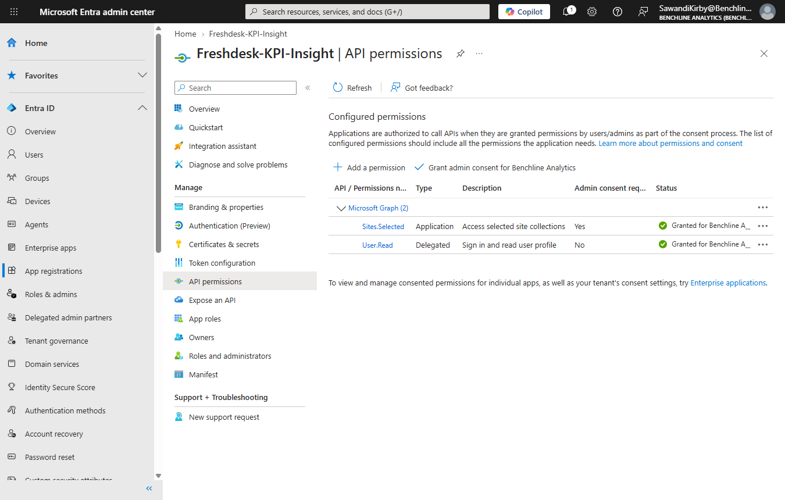
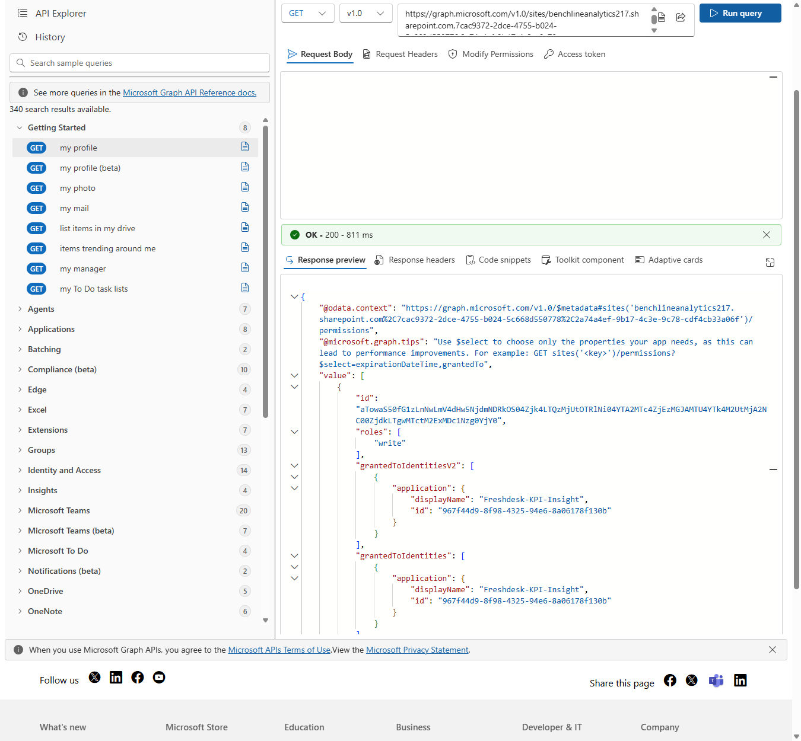

# Claude Daily Insight

[⬅ Back to README](README.md)

`scripts/daily_insight.py` writes the 2-4 sentence summary at the top of the dashboard. Run it after Flow B's 6pm check so `BelowTarget` is final for the day.

```
python scripts/daily_insight.py                    # latest day in Ticket_KPI_Daily
python scripts/daily_insight.py --date 2026-09-27
```


## Access: one app, one site

The script authenticates as an Entra app, `Freshdesk-KPI-Insight`, using the client-credentials flow. It holds the Microsoft Graph application permission `Sites.Selected`, which grants nothing until a specific site is granted to it.



The site grant was made in Graph Explorer with `POST /sites/{site-id}/permissions`, role `write`. The app can read and write this one SharePoint site and nothing else in the tenant.



## Python counts, Claude writes

Python reads `Agent_Targets` and `Ticket_KPI_Daily` through Graph and builds a facts object for the report date:

| Field | Meaning |
|---|---|
| `team.tickets` / `team.target` | Team totals for the day |
| `team.agents_below` | Agents below target |
| `agents[].tickets` / `target` / `below` | Each agent's standing |
| `agents[].days_below_in_a_row` | Streak length over tracked days |
| `agents[].yesterday` | Previous tracked day's tickets and target |
| `agents[].target_changed_today` | Whether the target differs from yesterday's |
| `last_day_all_at_target` | Most recent day the whole team hit target |

Claude gets only that JSON. The system prompt tells it to use only those facts, never invent a number, name or cause, lead with who needs attention, and stay within 2-4 plain sentences. Because Python does the arithmetic, Claude never has to count anything.

Model settings: low effort with server-side fallbacks enabled. A refusal or an empty response exits without writing anything.

## Writing the summary

The text upserts into `Daily_Summary`: one row per date, updated in place if the script runs again for that date. The `Date` column is written at noon UTC, because midnight UTC would show up as the previous evening in the site's US time zone.

The dashboard's banner reads the latest row through a `Latest Summary` measure.

## Setup

1. `python -m pip install anthropic`
2. Fill in `scripts/.env` (gitignored; see `scripts/.env.example`):

| Key | Value |
|---|---|
| `MS_TENANT_ID` | Entra tenant ID |
| `MS_CLIENT_ID` | `Freshdesk-KPI-Insight` app's client ID |
| `MS_CLIENT_SECRET` | App client secret |
| `ANTHROPIC_API_KEY` | Claude API key |
| `SHAREPOINT_HOSTNAME` | The tenant's SharePoint hostname |

## Daily routine

Seeder (before 6pm ET) -> Flow B runs at 6pm -> `python scripts/daily_insight.py` -> Refresh in Power BI.
