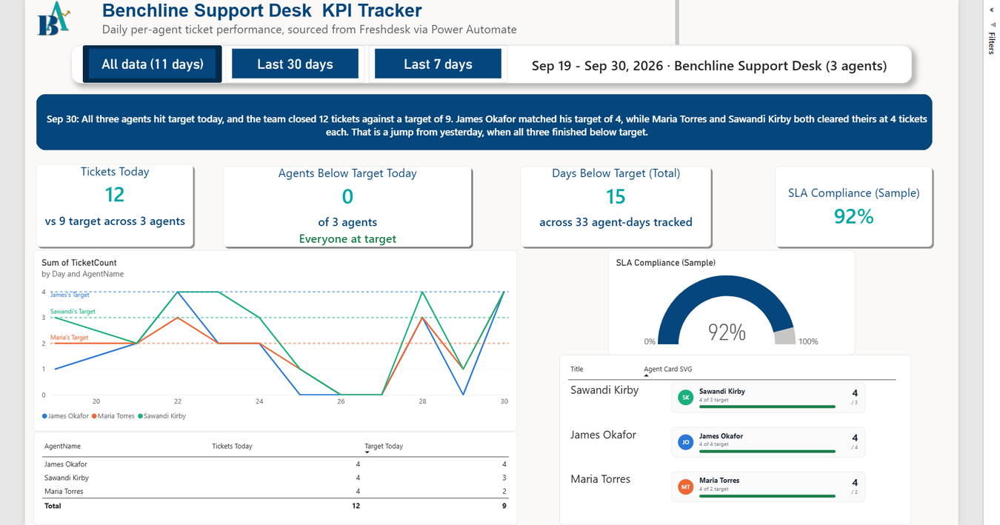
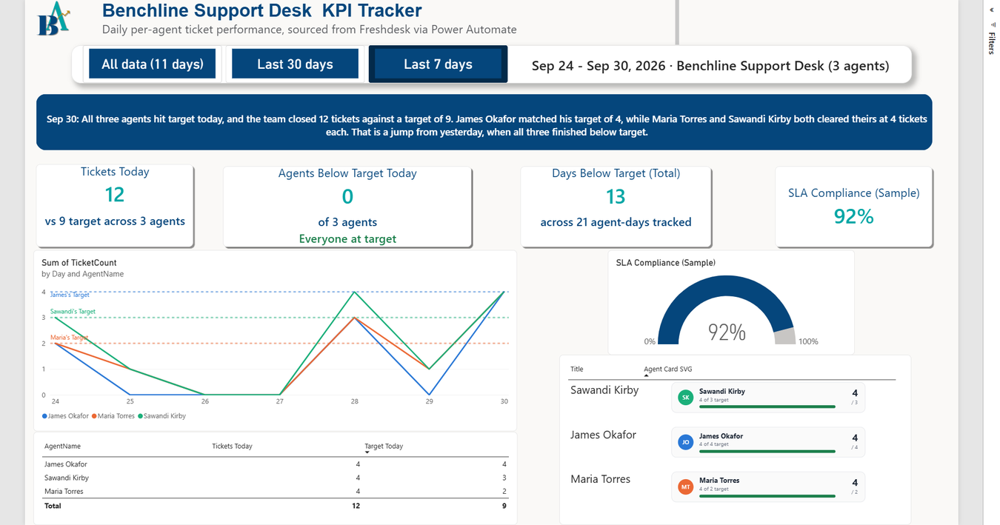
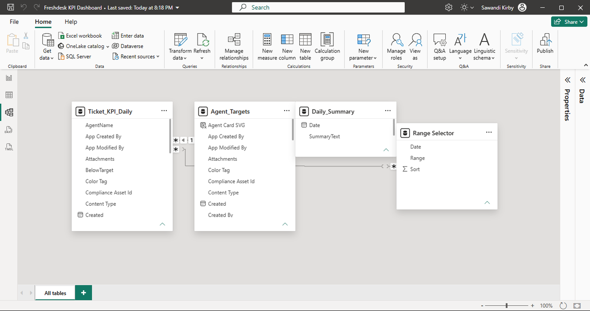

# Power BI Dashboard

[⬅ Back to README](README.md)

Built in Power BI Desktop against the three SharePoint lists, then published to the Power BI Service for these captures. The `.pbix` isn't in the repo because the M365 trial tenant it connects to is temporary.



## Layout, top to bottom

- **Header:** title, subtitle and range buttons, with a caption showing the date span in view.
- **Daily Insight banner:** the latest `Daily_Summary` row, prefixed with its date.
- **KPI cards:** Tickets Today, Agents Below Target Today (names the agents when there are any), Days Below Target (Total) and SLA Compliance (Sample).
- **Line chart:** tickets per agent per day, with each agent's target as a dashed line in that agent's color.
- **Today vs target:** a table and a set of per-agent SVG cards.
- **SLA gauge:** sample value, labeled as such.

## Measures

All on `Ticket_KPI_Daily`. "Today" means the latest date in the data.

```
Tickets Today =
CALCULATE(SUM(Ticket_KPI_Daily[TicketCount]),
    Ticket_KPI_Daily[Date] = MAX(Ticket_KPI_Daily[Date]))

Target Today =
CALCULATE(SUM(Ticket_KPI_Daily[Target]),
    Ticket_KPI_Daily[Date] = MAX(Ticket_KPI_Daily[Date]))

Agents Below Target Today =
CALCULATE(DISTINCTCOUNT(Ticket_KPI_Daily[AgentName]),
    Ticket_KPI_Daily[Date] = MAX(Ticket_KPI_Daily[Date]),
    Ticket_KPI_Daily[BelowTarget] = TRUE())

Days Below Target (Total) =
CALCULATE(COUNTROWS(Ticket_KPI_Daily),
    Ticket_KPI_Daily[BelowTarget] = TRUE())

Target James =
CALCULATE(MAX(Ticket_KPI_Daily[Target]),
    Ticket_KPI_Daily[AgentName] = "James Okafor",
    Ticket_KPI_Daily[Date] = MAX(Ticket_KPI_Daily[Date]))
```

`Target Maria` and `Target Sawandi` follow the same pattern as `Target James`. `SLA Compliance (Sample)` is a constant 0.92 placeholder.

SharePoint's Yes/No column loads into Power BI as True/False. The first versions of the BelowTarget measures compared to `"Yes"` and errored with a misleading capacity/license message until they were changed to `TRUE()`.

## Target lines

Power BI has no built-in per-series target line. Each dashed line is a constant line in the Analytics pane whose value is bound through fx to that agent's target measure, so a target change in `Agent_Targets` shows up after the next flow run and a refresh. An earlier version used typed-in numbers, and Maria Torres's line drew at 1 when her target was 2.

The chart uses Linear lines on a plain Date axis. Smooth interpolation overshot the data and bridged days with no rows, and the Date Hierarchy's Day level would merge the same day number across months.

## Range buttons

A calculated table, `Range Selector`, holds three options: All data (N days), Last 30 days and Last 7 days, each counted back from the latest date in the data rather than from today's calendar date. It relates to `Ticket_KPI_Daily[Date]` and drives a Button slicer. A `Range Caption` measure prints the date span in view.

The first published version highlighted "Last 7 days" without filtering anything. The relationship from `Range Selector` to `Ticket_KPI_Daily` was fixed in Model view and republished.



## Per-agent cards

`Agent Card SVG` is a calculated column on `Agent_Targets` with Data category set to Image URL. It builds an SVG for each agent showing initials, today's count against target and a progress bar, and the table renders it as an image. One DAX gotcha came up here: a variable named `Status` fails with "syntax for 'Status' is incorrect," so the variable is named `LineText`.

## Model


