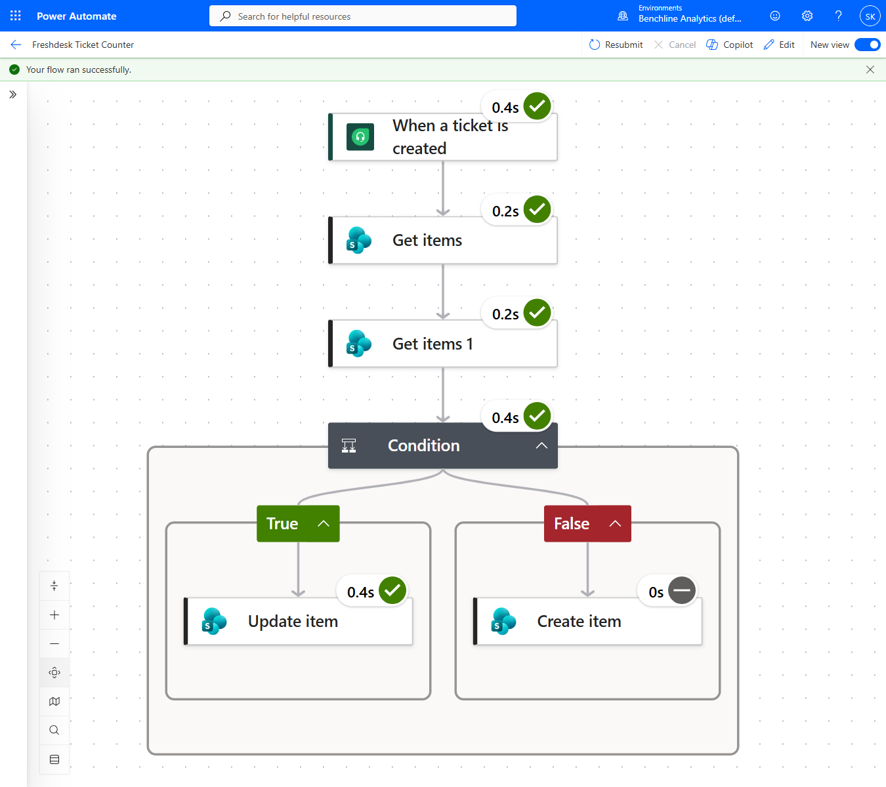
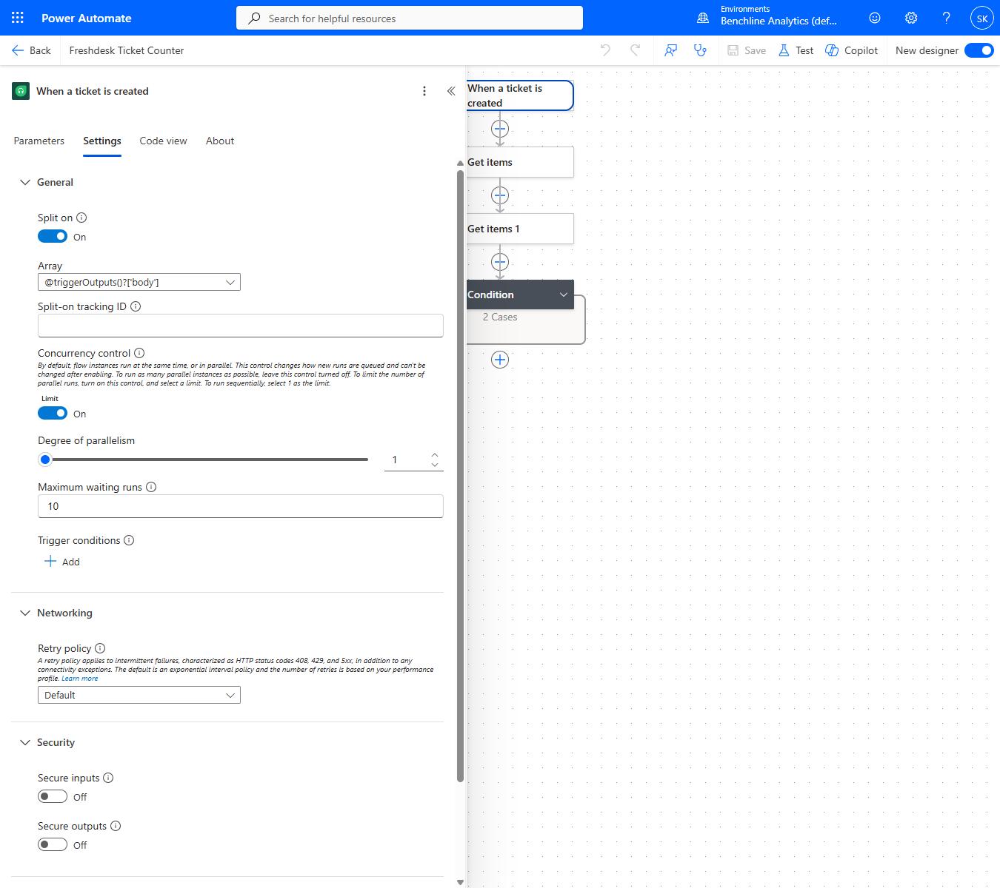
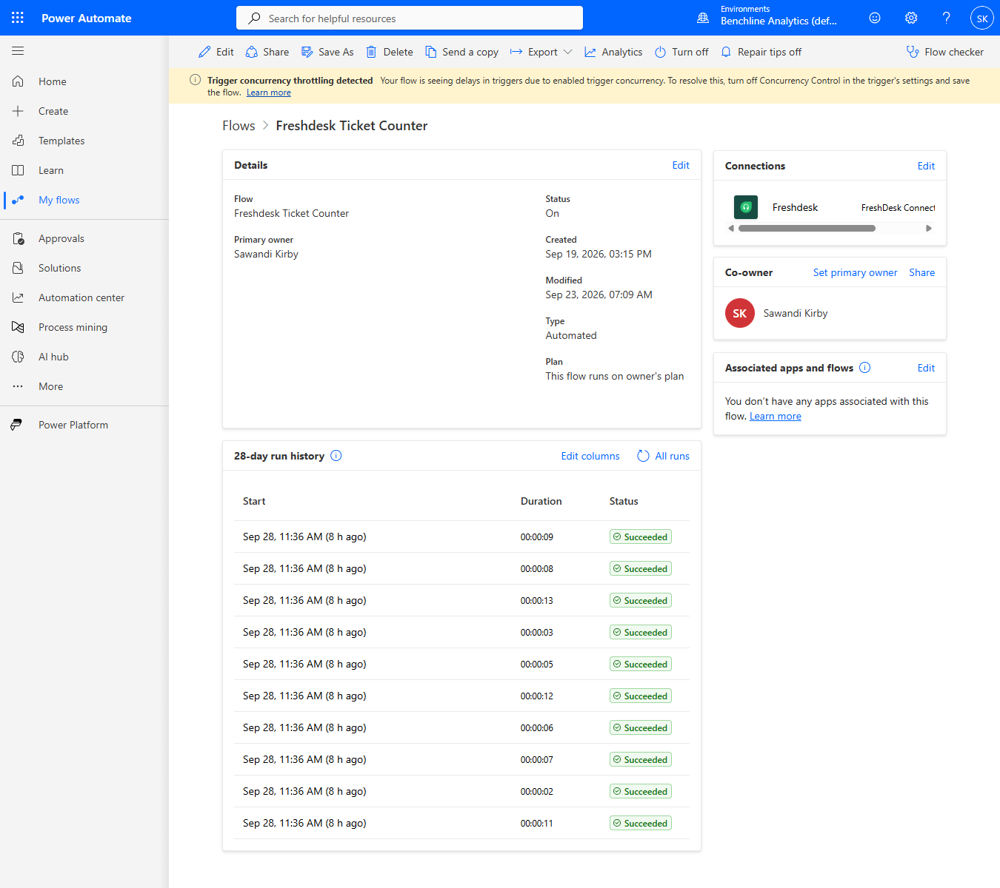

# Flow A: Freshdesk Ticket Counter

[⬅ Back to README](README.md)

Event-driven. Runs once for every new Freshdesk ticket and keeps a running count per agent per day in `Ticket_KPI_Daily`.



## Steps

1. **Trigger:** Freshdesk "When a ticket is created." The connector polls every 15 seconds. Its "Agent Id" output is the API's `responder_id`.
2. **Get items** on `Agent_Targets`, filtered to the row whose `FreshdeskAgentID` matches the ticket's Agent Id. This gives the agent name and current target.
3. **Get items 1** on `Ticket_KPI_Daily`, filtered to that agent and today's date.
4. **Condition:** does a row exist for today?
   - **Yes:** Update item, `TicketCount + 1`.
   - **No:** Create item with `TicketCount = 1`, `Target` from `Agent_Targets`, and the agent name in both `Title` and `AgentName`.

## Typed expressions instead of dynamic-content tokens

Clicking a dynamic-content field that comes from an array output (like `Title` from step 2's results) makes the designer wrap the action in a "For each" loop on its own. Every field reading from `Agent_Targets` uses a typed expression instead, which avoids the auto-wrap:

```
first(outputs('Get_items')?['body/value'])?['Title']
```

## The concurrency race

The first live test seeded 8 tickets. All 8 runs showed Succeeded, and `Ticket_KPI_Daily` ended up with 8 rows at `TicketCount = 1` instead of one row per agent.

Freshdesk's trigger had picked up all 8 tickets in a single poll and Power Automate started 8 runs in parallel. Each run's Get items 1 read "no row for today" before any other run's Create item had committed, so every run created its own row. That's a read-then-write race. The individual steps were correct.

**Fix:** trigger Settings -> Concurrency Control on, Degree of Parallelism 1. Runs now go one at a time. After deleting the 8 bad rows, a 6-ticket re-run produced one row per agent with accumulated counts.



Power Automate now shows a "Trigger concurrency throttling detected" banner on this flow. That's the expected cost of forcing sequential runs, and at this volume the queue clears in seconds.



## Known limits

- **Date uses `utcNow()`.** A ticket created after 8pm Eastern lands on the next day's row. It doesn't affect the 6pm check, but it can shift counts between days.
- **MFA breaks the SharePoint connection.** On 9/21 the tenant started enforcing MFA on service connections (`AADSTS50076`), and all 6 runs that day failed. The connection was re-signed and later tickets counted normally. Tickets #53-58 from the outage were never counted.
