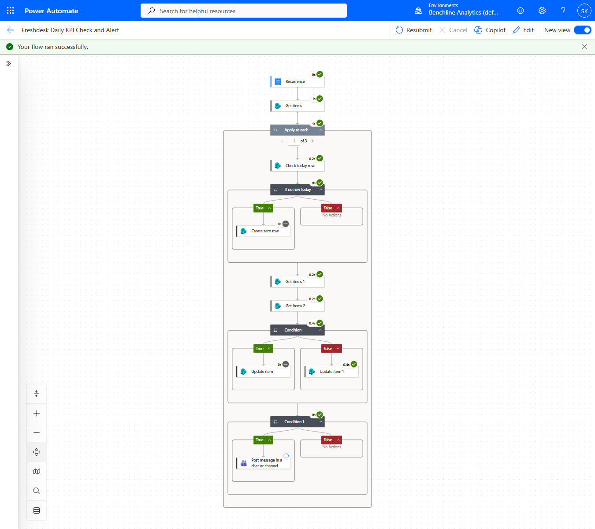
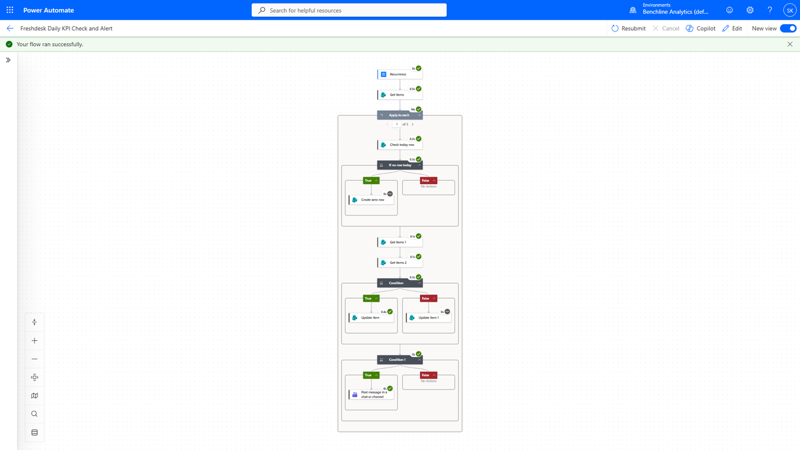
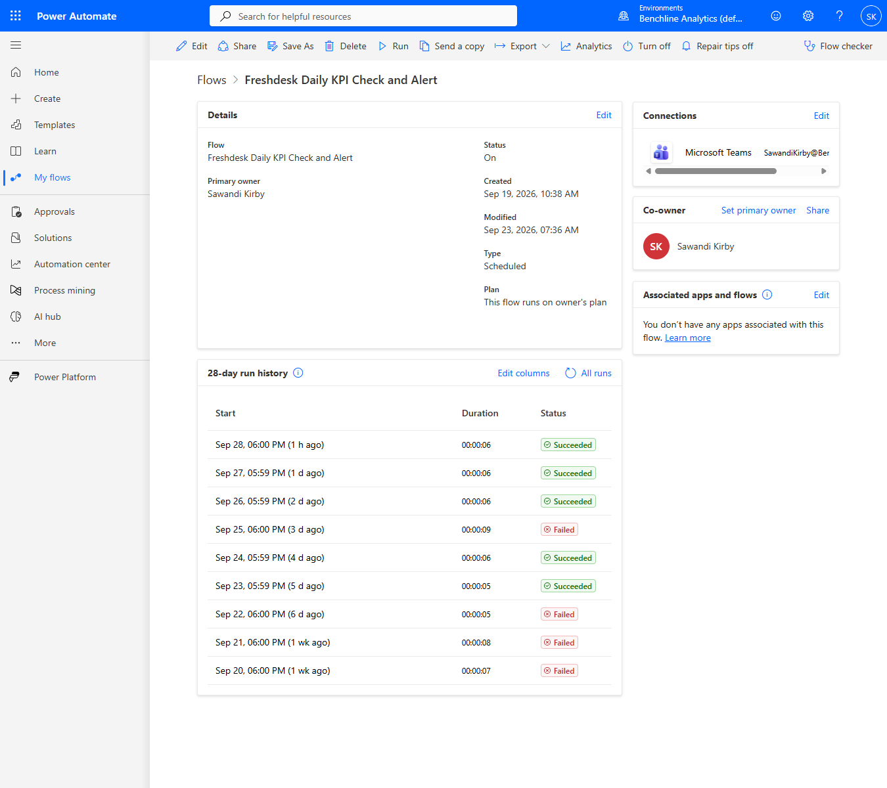

# Flow B: Daily KPI Check and Alert

[⬅ Back to README](README.md)

Runs at 6pm ET on a Recurrence trigger. Sets `BelowTarget` on every agent's row for today and alerts the supervisor in Teams on the first day an agent drops below target.



## Steps

1. **Recurrence**, daily at 6pm ET.
2. **Get items** on `Agent_Targets` (all agents).
3. **Apply to each** agent:
   1. **Check today row** on `Ticket_KPI_Daily` for this agent and today.
   2. **If no row today** (zero results): **Create zero row** with `TicketCount = 0`, `Target` from `Agent_Targets` and `BelowTarget = Yes`.
   3. **Get items 1** (today's row) and **Get items 2** (yesterday's row).
   4. **Condition:** today's `TicketCount` < `Target`. True sets `BelowTarget` to Yes, False sets it to No.
   5. **Condition 1:** today is below target and yesterday wasn't. True posts the Teams message.

## Why the zero row exists

Flow A only runs when a ticket is created, so an agent with no tickets has no row. Without one, Get items 1 returns nothing, the comparison gets null and the run crashes on the exact case the alert is meant for. The zero-row guard creates the missing row before anything reads it.

## The streak rule

Condition 1 posts only on the first day of a below-target streak. Someone below target four days running gets one alert, not four. Power Automate's condition builder allows only one AND/OR operator across all rows, so the "yesterday wasn't below" half is a single expression:

```
not(and(greater(length(<yesterday's rows>), 0),
        equals(first(<yesterday's rows>)?['BelowTarget'], true)))
```

`<yesterday's rows>` is the `body/value` output of Get items 2.

A missing yesterday row counts as "not below," so the first tracked day can still alert.

## The alert

Posted as the Flow bot in a chat with the supervisor. Maria Torres and James Okafor are fictional agents with no Teams identity, and the alert is meant for the supervisor anyway.


The 9/29 run posted for Sawandi Kirby and Maria Torres in iterations 1 and 2. Iteration 3 (James Okafor) skipped the post because he was already below target on 9/28.



The message reads "1 tickets today." The flow expression doesn't handle the singular.

## What broke along the way

| Date | Failure | Cause | Fix |
|---|---|---|---|
| 9/20-9/22 | Every run failed | Flow A wrote the agent name only to `Title`, so Get items 1's `AgentName` filter matched nothing and the comparison got null | Flow A now writes `AgentName`; 9 existing rows backfilled through SharePoint REST |
| 9/22 | All rows read BelowTarget Yes, even above target | The column defaults to Yes and Flow B had never completed | Resolved by the fix above; 9 rows corrected by hand so the streak rule wouldn't suppress the next alert |
| 9/25 | Failed at Condition 1 on the first all-below night | Teams connection needed an MFA re-sign-in | Reconnected; first confirmed alert on 9/29 |

Runs on 9/26-9/28 showed Succeeded with the Teams connection still broken. The streak rule skipped the alert branch on those nights, so the bad connection was never touched. A green run history doesn't prove the alert path works.


