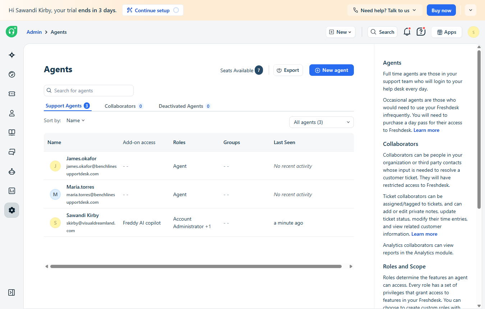
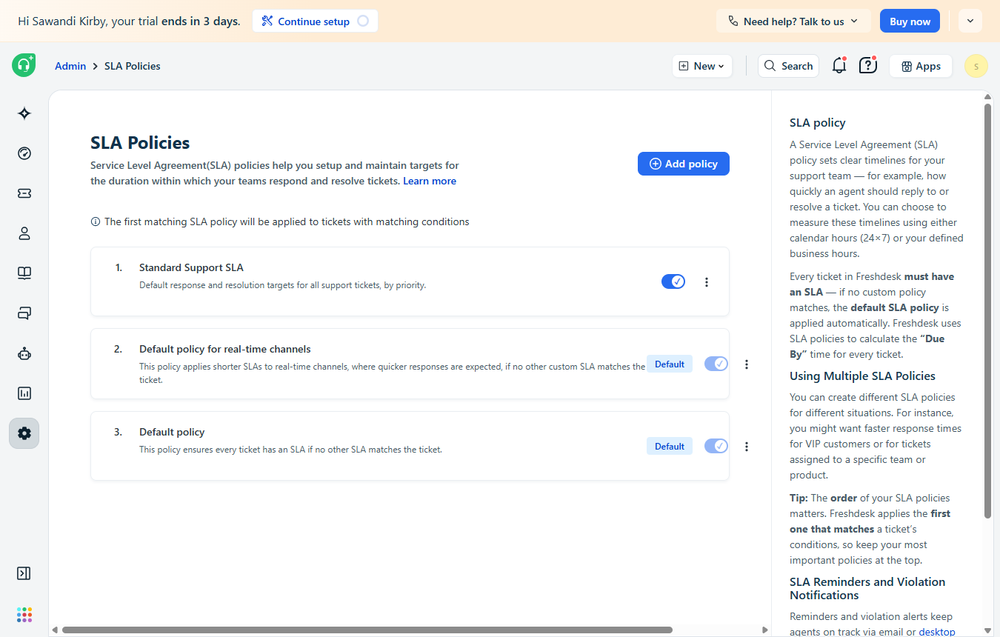
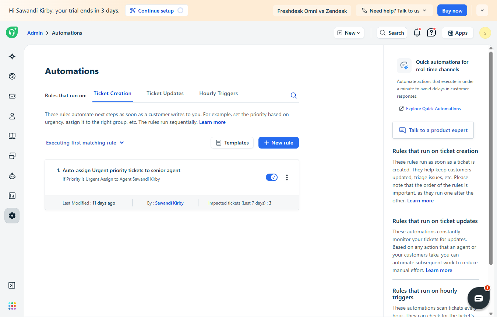
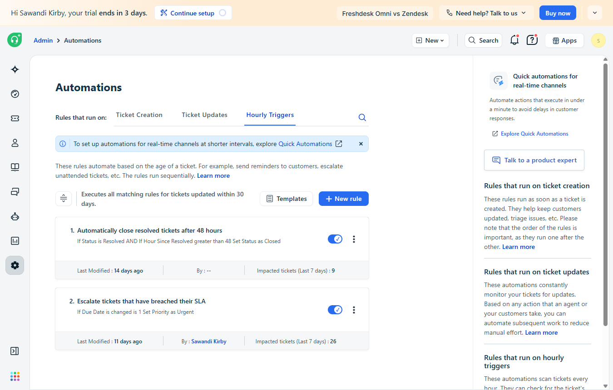
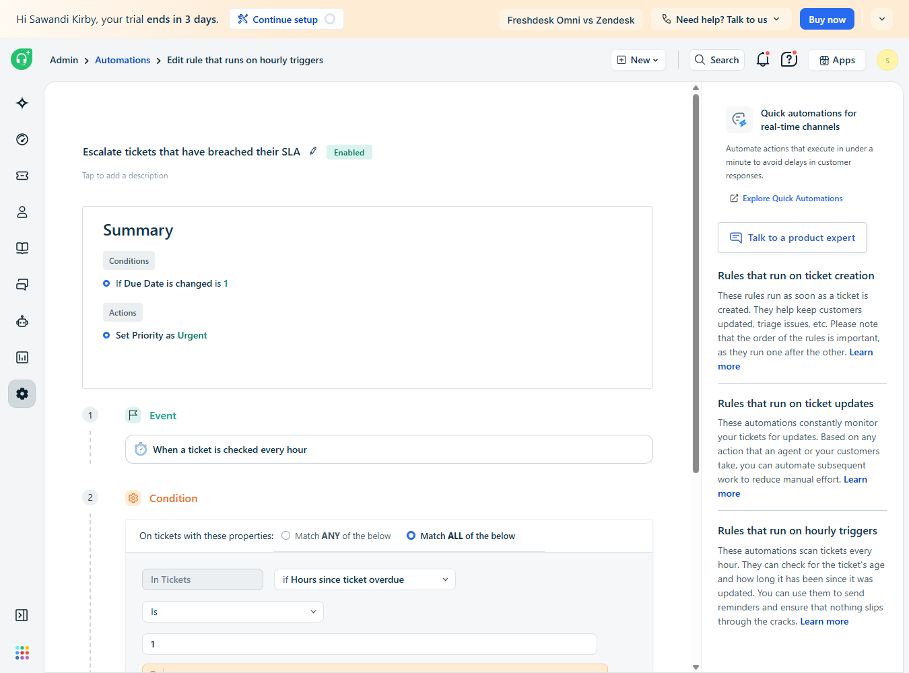

# Freshdesk Setup

[⬅ Back to README](README.md)

Freshdesk trial account, company "Benchline Support Desk," industry set to Banking and Financial Services.

## Agents

| Agent | Role |
|---|---|
| Sawandi Kirby | Account Administrator (senior agent) |
| Maria Torres | Agent |
| James Okafor | Agent |



## SLA policy

One policy, "Standard Support SLA," applied when the source is Email or Portal, with Freshdesk's default priority-based response and resolution targets.



## Automation rules

| Rule | Trigger | Action |
|---|---|---|
| Auto-assign Urgent priority tickets to senior agent | Ticket creation | Assign to Sawandi Kirby |
| Escalate tickets that have breached their SLA | Hourly | Hours since ticket overdue is 1 -> set Priority to Urgent |
| Automatically close resolved tickets after 48 hours | Hourly | Freshdesk default, left on |





The escalation rule's condition really is "Hours since ticket overdue is 1." Freshdesk's Summary panel mislabels it as "Due Date is changed is 1," which is visible in the screenshot below.



The auto-assign rule affects the KPI counts. On 9/19, ticket #49 was created for James Okafor with Urgent priority and reassigned to Sawandi Kirby before Flow A's trigger fired, so Flow A counted it for Sawandi. The flows report Freshdesk's final assignment, not the seeder's original round-robin.

## Canned response

"Acknowledging a Reported Fraud or Unauthorized Charge," shortcut `/fraudack`, available to all agents.

## Ticket seeder

`scripts/seed_daily_tickets.py` creates realistic financial-services tickets through the Freshdesk v2 REST API (Basic Auth, API key + `X`). Each ticket gets a random subject from 10 templates, a priority weighted toward Low/Medium and a status weighted toward Open, and is assigned round-robin in the order Sawandi, Maria, James.

```
python scripts/seed_daily_tickets.py            # 5 tickets
python scripts/seed_daily_tickets.py --count 12
```

Freshdesk sets a ticket's creation time when the API call lands, so a backdated history can't be created in one batch. The seeder ran once per real day, with counts varied on purpose to produce both below-target and above-target days.

Setup: copy `scripts/.env.example` to `scripts/.env` and fill in `FRESHDESK_API_KEY`. The `.env` file is gitignored.


