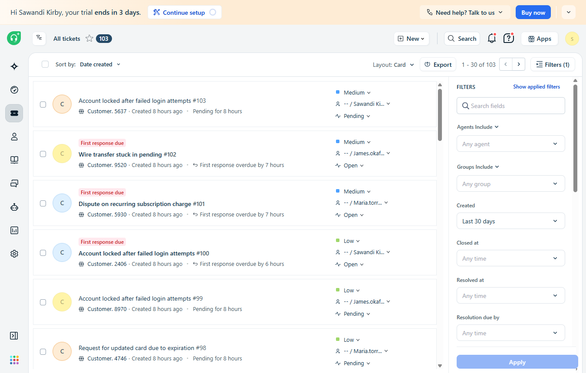
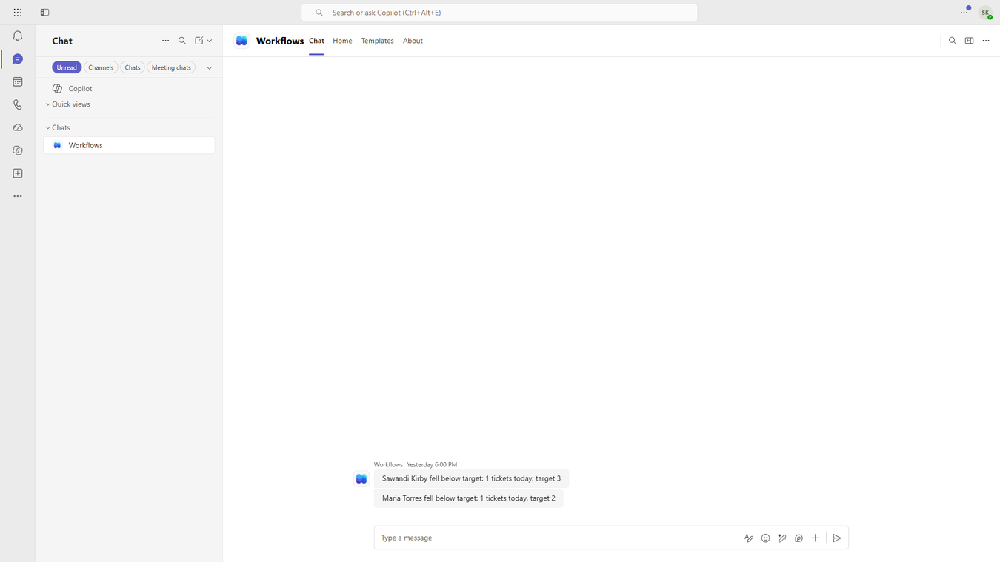
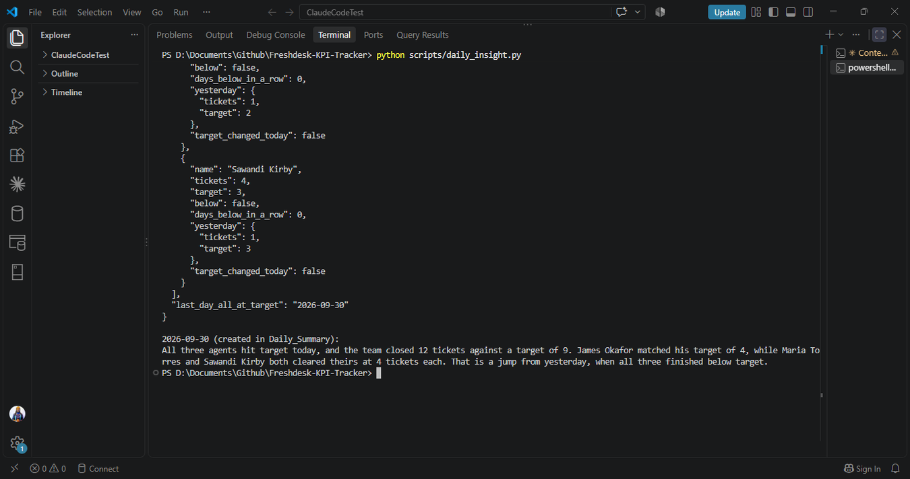

# Freshdesk KPI Tracker

**Power Automate | Power BI | Helpdesk Analytics**

[](Dashboard_Explained.md)

A daily KPI system for a three-agent support desk. Power Automate counts each agent's Freshdesk tickets into SharePoint, and a 6pm check posts a Teams alert on the first day someone drops below target. A Claude script then writes a plain-English summary that sits at the top of a Power BI dashboard. It rebuilds the architecture of a real Upwork contract on a helpdesk whose API was reachable.

---

# Project Overview

The original contract asked for a supervisor's view of daily ticket load per agent, a flag when someone falls below target and a short written summary, with nobody pulling reports by hand. That client ran Zendesk behind SSO, and the SSO configuration blocked the API connection the build depended on. This repo rebuilds the same design on a Freshdesk trial wired into a Microsoft 365 Business trial tenant, so the flows and dashboard run on the real Microsoft stack instead of a local stand-in.

Tickets are seeded by a Python script that creates realistic banking-support tickets each day. Everything after ticket creation runs live, from the Freshdesk trigger through the Teams alert.

[](Business_Problem.md)

---

# How It Works

```
Freshdesk ticket created
  -> Flow A (Ticket Counter)  -> SharePoint: Ticket_KPI_Daily
  -> Flow B (6pm KPI Check)   -> BelowTarget flag + Teams alert
  -> daily_insight.py (Claude) -> SharePoint: Daily_Summary
  -> Power BI dashboard
```

Both flows use standard connectors only. The generic HTTP action needs Power Automate Premium, which M365 Business doesn't include, so the design split into an event-driven counter and a nightly check.

## 1️⃣ Freshdesk Setup

Three agents (Sawandi Kirby, Maria Torres, James Okafor), a Standard Support SLA policy and two automation rules: Urgent tickets auto-assign to the senior agent, and tickets one hour past SLA escalate to Urgent. `scripts/seed_daily_tickets.py` creates a set number of tickets through the Freshdesk v2 API, round-robin across the agents. Freshdesk stamps creation time on arrival, so a week of history couldn't be backdated in one batch. The seeder ran once per real day instead.



[](Freshdesk_Setup.md)

## 2️⃣ SharePoint Lists

`Agent_Targets` holds each agent's Freshdesk ID and daily target. `Ticket_KPI_Daily` gets one row per agent per day (TicketCount, Target, BelowTarget). `Daily_Summary` stores the Claude insight, one row per date. Targets came from the first two real days of volume, rounded up. James Okafor's moved from 2 to 4 on 9/28.


[](SharePoint_Lists.md)

## 3️⃣ Flow A: Ticket Counter

Fires on Freshdesk's "When a ticket is created" trigger, looks up the assigned agent in `Agent_Targets`, then increments today's row or creates it. The first live test with 8 tickets produced 8 separate rows. Freshdesk's trigger had picked up the whole batch in one 15-second poll and launched 8 parallel runs, and each one read "no row yet" before any other run had written one. Setting trigger concurrency to 1 fixed it. The throttling banner Power Automate now shows on this flow is the expected cost.


[](Flow_A_Explained.md)

## 4️⃣ Flow B: Daily KPI Check and Alert

Runs at 6pm ET. For each agent it compares today's count to target, sets `BelowTarget`, and posts to Teams only on the first day of a below-target streak, so the supervisor gets one alert per slump instead of one per day. An agent with zero tickets never fires Flow A, so Flow B creates a zero row for any missing agent before it checks.



The 9/29 run alerted on Sawandi and Maria. James was skipped because he was already below target the day before.

[](Flow_B_Explained.md)

## 5️⃣ Claude Daily Insight

`scripts/daily_insight.py` reads both lists through Microsoft Graph with an Entra app that has `Sites.Selected` write access to this one site. Python computes every number: standing vs target, streak length, change from yesterday, last day the whole team hit target. Claude only turns that JSON into 2-4 sentences, under a prompt that forbids inventing numbers or guessing causes. The result upserts into `Daily_Summary` and shows in the dashboard's top banner.



[](Daily_Insight_Explained.md)

## 6️⃣ Power BI Dashboard

Loads all three lists from SharePoint. Range buttons switch between all data and the last 7 or 30 days, counted back from the latest date in the data. Per-agent cards are SVG images built in a DAX calculated column. The line chart draws each agent's target as a dashed line bound to a live measure.


[](Dashboard_Explained.md)

---

# Key Metrics

| Metric | Definition |
|---|---|
| Tickets Today | TicketCount summed for the latest date, against all agents' summed targets |
| Agents Below Target Today | Agents with BelowTarget true on the latest date |
| Days Below Target (Total) | Agent-days with BelowTarget true in the selected range, out of all agent-days tracked |
| Days Below in a Row | Consecutive tracked days below target (insight script) |
| SLA Compliance (Sample) | Placeholder value, not pulled from Freshdesk; labeled Sample on the dashboard |

---

# Problems Found and Fixed

| Problem | Cause | Fix |
|---|---|---|
| Both flows failed silently on 9/21 | AADSTS50076: the tenant began enforcing MFA, invalidating the SharePoint connection | Re-signed the connection. Tickets #53-58 from the outage are still uncounted |
| Flow B failed every night 9/20-9/22 | Flow A wrote the agent name to Title only, so Flow B's AgentName filter returned nothing | Flow A now writes AgentName; 9 rows backfilled |
| 8 rows from an 8-ticket batch | Parallel runs racing on read-then-write | Trigger concurrency set to 1 |
| No Teams alert on 9/25 | Teams connection needed an MFA re-sign-in | Reconnected; alert confirmed 9/29 |
| BelowTarget measures errored in Power BI | Column loads as True/False; measures compared to "Yes" | Measures compare to TRUE() |
| Last 7 days button didn't filter | Range Selector relationship to Ticket_KPI_Daily | Fixed in Model view |

---

# Tools Used

- Freshdesk (v2 REST API, SLA policies, automation rules)
- Power Automate (standard connectors)
- SharePoint Online lists
- Microsoft Teams
- Microsoft Entra ID + Microsoft Graph
- Power BI Desktop + Service (DAX)
- Python
- Claude API

---

# Credits

[](https://www.freshworks.com/freshdesk/)
[](https://www.microsoft.com/microsoft-365)

---

# Author

**Sawandi Kirby**

Data Analytics & Business Intelligence
Benchline Analytics - Data intelligence for organizations that mean business.

- GitHub: https://github.com/visualkirby
- LinkedIn: https://linkedin.com/in/sawandi-kirby
- Kaggle: https://kaggle.com/sawandikirby
