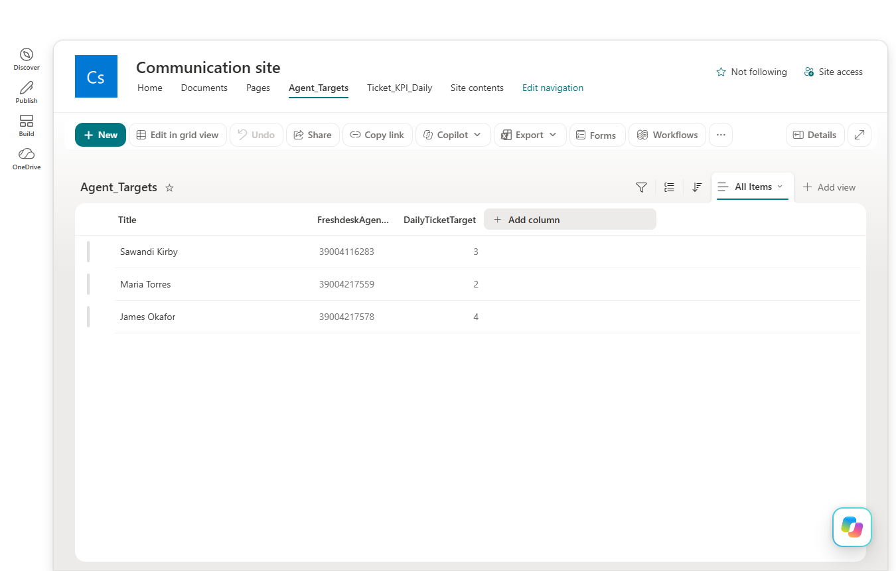
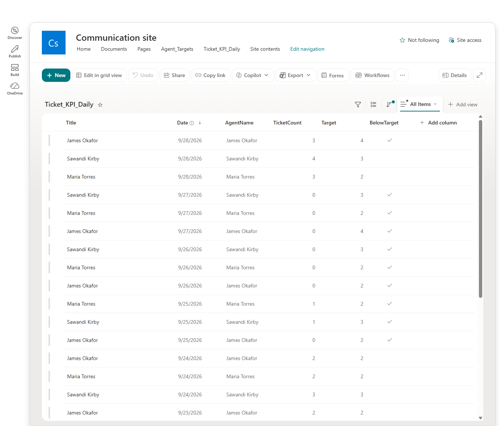
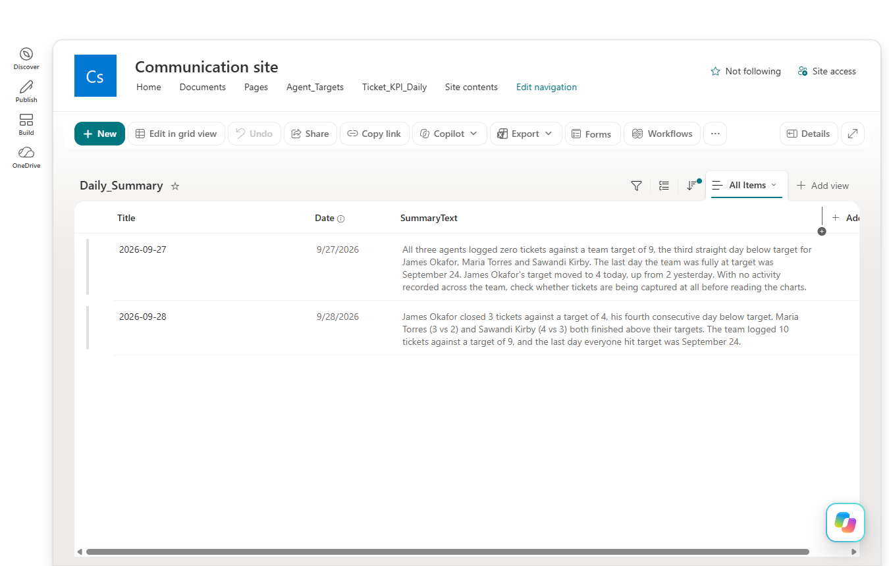

# SharePoint Lists

[⬅ Back to README](README.md)

Three lists on one SharePoint communication site in the M365 trial tenant.

## Agent_Targets

One row per agent. Flow A looks up the agent here by Freshdesk ID, and Flow B loops over it nightly.

| Column | Type | Notes |
|---|---|---|
| Title | Text | Agent name |
| FreshdeskAgentID | Number | Matches the ticket's `responder_id` |
| DailyTicketTarget | Number | Daily ticket target |

## Ticket_KPI_Daily

One row per agent per day. Flow A creates or increments it, and Flow B sets `BelowTarget` at 6pm.

| Column | Type | Notes |
|---|---|---|
| Title | Text | Agent name |
| AgentName | Text | Agent name; Flow B filters on this column |
| Date | Date only | The day the tickets count toward |
| TicketCount | Number | Tickets assigned that day |
| Target | Number | Copied from Agent_Targets when the row is created |
| BelowTarget | Yes/No | Default Yes until Flow B runs; loads as True/False in Power BI |

The agent name lives in `Title` on `Agent_Targets` and in `AgentName` here. Flow A originally wrote only `Title` on this list, which left `AgentName` blank and broke Flow B for three nights. See [Flow B Explained](Flow_B_Explained.md).

`Target` is stored on each row so a later target change doesn't rewrite history. Past days are judged against the target in force that day.

## Daily_Summary

One row per date, written by `scripts/daily_insight.py`. Re-running the script for the same date overwrites that row.

| Column | Type | Notes |
|---|---|---|
| Title | Text | Date as `YYYY-MM-DD` |
| Date | Date only | Written at noon UTC so it stays on the right day in the site's US time zone |
| SummaryText | Multiple lines (plain) | The Claude-written insight |

## How the targets were set

`DailyTicketTarget` stayed blank until real volume existed. After two seeded days (9/19 and 9/21), each agent's average was rounded up:

| Agent | Average | Target |
|---|---|---|
| James Okafor | 1.5 | 2 |
| Maria Torres | 2 | 2 |
| Sawandi Kirby | 2.5 | 3 |

On 9/28 James Okafor's target moved to 4. With both James and Maria at 2, his dashed target line sat directly under hers and couldn't be seen.
